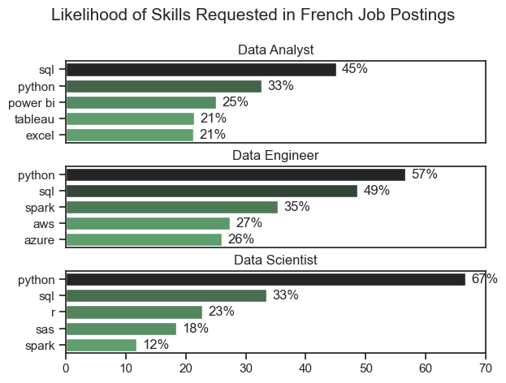
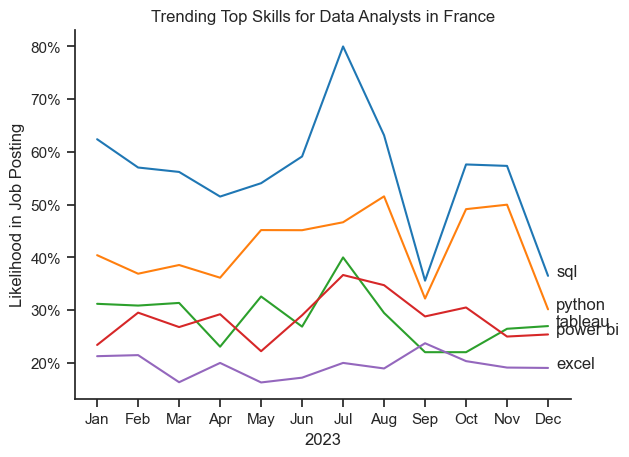
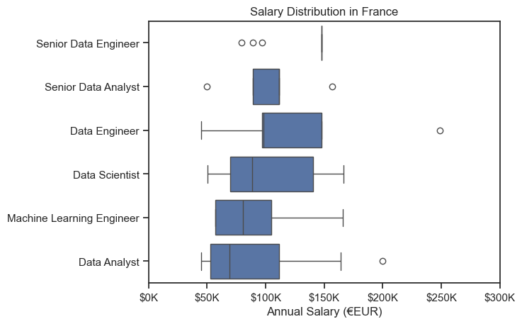
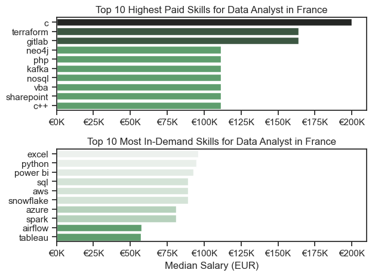
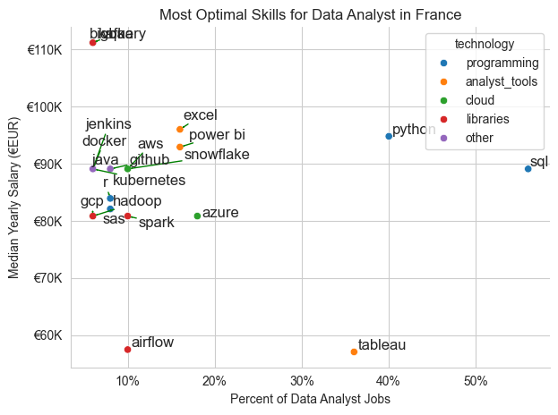

# The Analysis 

## 1. What are the most in demand skills for the top 3 most popular data roles?
To find the most in demand skills for the top 3 popular data roles based in France. I filtered our those positions that were the most popular, and then got the top 5 skills for these roles. This query highlights the most popular job titles and their top skills, showing which skills I should pay attention to depending on the role that I want

View my notebook with the detailed steps here :
[skills_demand.ipynb](skills_demand.ipynb)

Here is the link to my Tableau Profile if you want to view this project:
[Data Analyst Jobs](https://public.tableau.com/views/dataAnalystjobs/DataAnalystJobs?:language=en-US&:sid=&:redirect=auth&:display_count=n&:origin=viz_share_link)


### Visualizing the Data 
```
    Python 
fig, ax = plt.subplots(len(job_titles), 1)

for i, job_title in enumerate(job_titles):
    df_plot = df_skills_count[df_skills_count["job_title_short"] == job_title].head(5)
    df_plot.plot(kind="barh",x="job_skills",y="skill_count",ax=ax[i], title=job_title)
    ax[i].invert_yaxis()
    ax[i].set_ylabel("")
    ax[i].legend().set_visible(False)
    
fig.suptitle("Counts of Top Skills in Job Postings in France", fontsize=15)
fig.tight_layout(h_pad=0.5)
plt.show() 
    
```

### Results


### Insights
Based on top three roles in the data world here are the skills most in demand for each witih in the French Job Market

### Data Analyst :
SQL is the most requested skill at 45%.

Python is the second most requested skill at 33%.

Power BI at 25% and Tableau at 21% are important visualization tools, with PowerBi being slightly more in demand.

Excel is equally demanded as Tableau at 21%.

### Data Engineer:
Python leads as the most demanded skill at 57%.

SQL follows closely at 49%.

Spark is also significant skills at 35% of demanded skills.

Cloud platforms like AWS 27% and Azure 26% have notable demand, with AWS being slightly more in demand.

### Data Scientist:
Python is highly sought after at 67%.

SQL is important but less than Python art 33%.

R is requested 23% of the time.

SAS at 18% and Spark at 12% have lower demand compared to other skills.


# The Analysis
## 2. How are in-demand skills trending for Data Analysts in France ?.

### Visualize Data
```
 Python:
 
 from matlplotlib.ticker import PercentFormatter
 
 df_plot = df_da_fr_percent.iloc[:, :5]
sns.lineplot(df_plot,dashes=False,palette="tab10")
sns.set_theme(style="ticks")
sns.despine()

plt.title("Trending Top Skills for Data Analysts in France")
plt.ylabel("Likelihood in Job Posting")
plt.xlabel("2023")
plt.legend().remove()

ax = plt.gca()
ax.yaxis.set_major_formatter(PercentFormatter())

for i in range(5):
    plt.text(11.2,df_plot.iloc[-1,i], df_plot.columns[i])
```

### Results:



### Insights
- SQL remains the most in demand skill throughout 2023, though it has seen a steep decline in demand from December onwards.
- Python has also remained consistent though it follows the same trend as SQL towards the end of the year, a steep decline
- Tableau and PowerBi overall, remain equal in their demands, though Tableau seems to be slightly more in demand as through the year
- Excel remains steady in its demand, not showing any major increase or decrease in demand

# The Analysis
### 3. How well do jobs and skills pay for Data Analysts in France?
### Salary Analysis for Data roles

```
Python :
    sns.boxplot(data=df_fr_top6, x="salary_year_avg", y="job_title_short", order=job_order)
    sns.set_theme(style="ticks")
    
    plt.title("Salary Distribution in France")
    plt.xlabel("Annual Salary (€EUR)")
    plt.ylabel("")
    plt.xlim(0,300000)
    ticks_x = plt.FuncFormatter(lambda y, pos: f"${int(y/1000)}K")
    ax = plt.gca().xaxis.set_major_formatter(ticks_x)
    plt.show()
```

### Results 


### Insights
- Data Analyst : Data Analyst roles in France seem to be the least paid, starting at around 50-52K but the earning potential can go as high as over 100k
- Machine Learning Engineers have a similar earning potential as Data Analysts, though this might be to the role not being as common in France as in other countries
- Data Scientists have a higher entrance salary, though this aligns with the seniority of the role and the skills that are demanded as well
- Data Engineers both Senior and non Senior roles see to pay the most, with an average salary of over 100K
- As expected, the more senior the role the more the pay increases

### Highest Paid and Most Demanded Skills for Data Analysts in France
### Visualize Data
```
Python:
    fig, ax = plt.subplots(2,1)

    sns.set_theme(style="ticks")
    sns.barplot(data=da_fr_top_pay,x="median",y=da_fr_top_pay.index,ax=ax[0], hue="median",palette="dark:g_r")
    
    ax[0].legend().remove()
    # df_da_fr_top_pay[::-1].plot(kind="barh", y="median", ax=ax[0], legend=False)
    ax[0].set_title("Top 10 Highest Paid Skills for Data Analyst in France")
    ax[0].set_ylabel("")
    ax[0].set_xlabel("")
    ax[0].xaxis.set_major_formatter(plt.FuncFormatter(lambda y, pos: f"€{int(y/1000)}K"))
    
    sns.barplot(data=da_fr_skills, x="median",y=da_fr_skills.index,ax=ax[1], hue="median",palette="light:g_r")
    ax[1].legend().remove()
    # df_da_fr_skills[::-1].plot(kind="barh",y="median",ax=ax[1], legend=False)
    ax[1].set_title("Top 10 Most In-Demand Skills for Data Analyst in France")
    ax[1].set_ylabel("")
    ax[1].set_xlabel("Median Salary (EUR)")
    ax[1].set_xlim(ax[0].get_xlim())
    ax[1].xaxis.set_major_formatter(plt.FuncFormatter(lambda y, pos: f"€{int(y/1000)}K"))
    
    fig.tight_layout()
    plt.show()
```


C seems to be the highest paying skills in France or Data Analyst, followed by terraform and gitlab. C pays close to 200K
Regarding the skills that are most in demand : Excel, python and powerBi seem to be the highest paying at over 75K with SQL coming at fourth place at 75K. Tableau seems to be the skills that pays the list with just over 50K


# The Analysis
## 4. What is the most optimal skill to learn for Data Analysts in France

```
sns.scatterplot(
    data=df_plot,
    x="skill_percent",
    y="median_salary",
    hue="technology",
)

sns.despine()
sns.set_theme(style="ticks")


texts = []
for i, txt in enumerate(df_da_fr_skills_high_demand.index):
    texts.append(plt.text(df_da_fr_skills_high_demand["skill_percent"].iloc[i], df_da_fr_skills_high_demand["median_salary"].iloc[i], txt))
    
adjust_text(texts, arrowprops=dict(arrowstyle="->", color="green", lw=1))

ax = plt.gca()
ax.yaxis.set_major_formatter(plt.FuncFormatter(lambda y, pos: f"€{int(y/1000)}K"))
    
plt.xlabel("Percent of Data Analyst Jobs")
plt.ylabel("Median Yearly Salary (€EUR)")
plt.title("Most Optimal Skills for Data Analyst in France")

ax=plt.gca()
ax.yaxis.set_major_formatter(plt.FuncFormatter(lambda y, pos: f"€{int(y/1000)}K"))
ax.xaxis.set_major_formatter(PercentFormatter(decimals=0))

plt.tight_layout()    
plt.show()
```

### Results


### Insights
- Our Scatter plot shows that most of the programming skills tend to cluster around the higher salary levels compared to other categories, indicating that programming expertise might offer better salary and better benefits for aspiring Data Analysts.
- For the Analytics tools, PowerBi seems to be better paying that Tableau, PowerBi hovering around the 100k salary mark whereas Tableau is under 60K
- Interestingly enough, cloud skills like Azure pay less than github and AWS skills though overall Cloud base skills dare the highest paying type of skills


